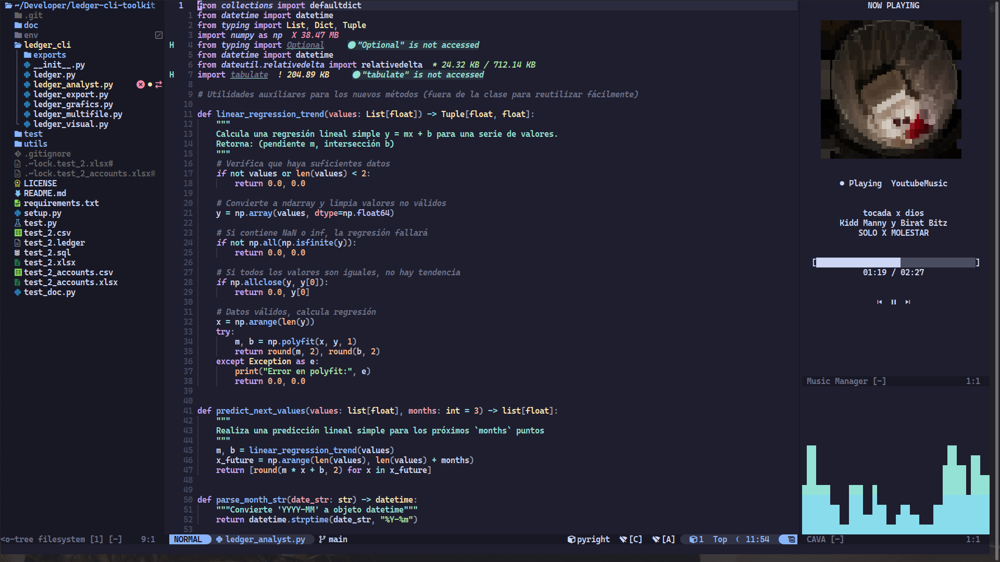
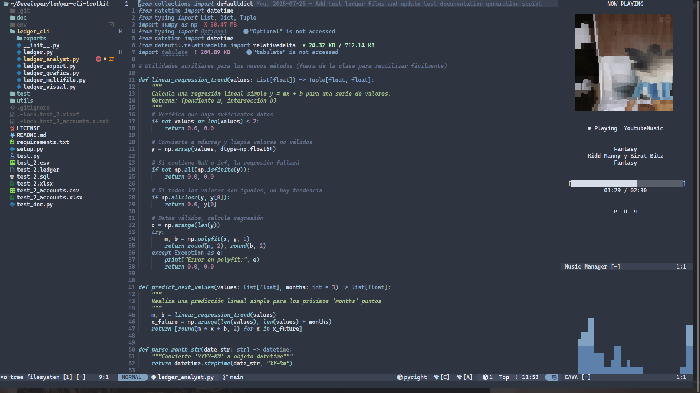
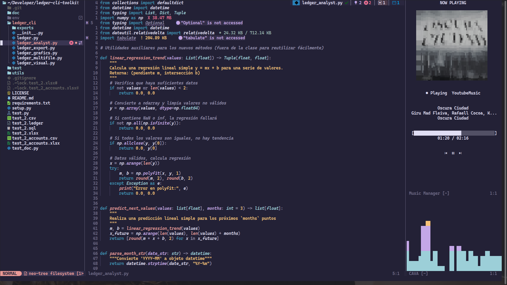
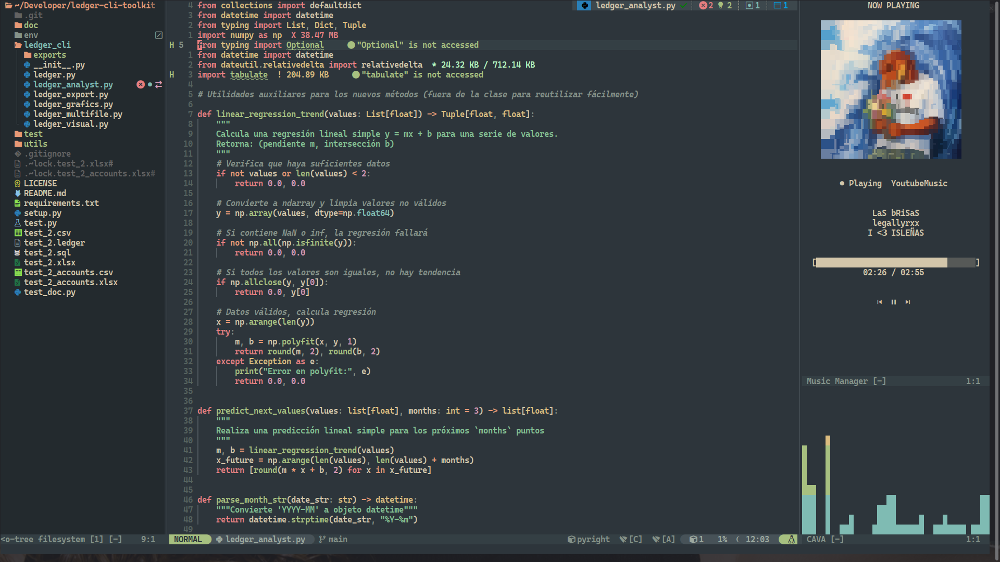
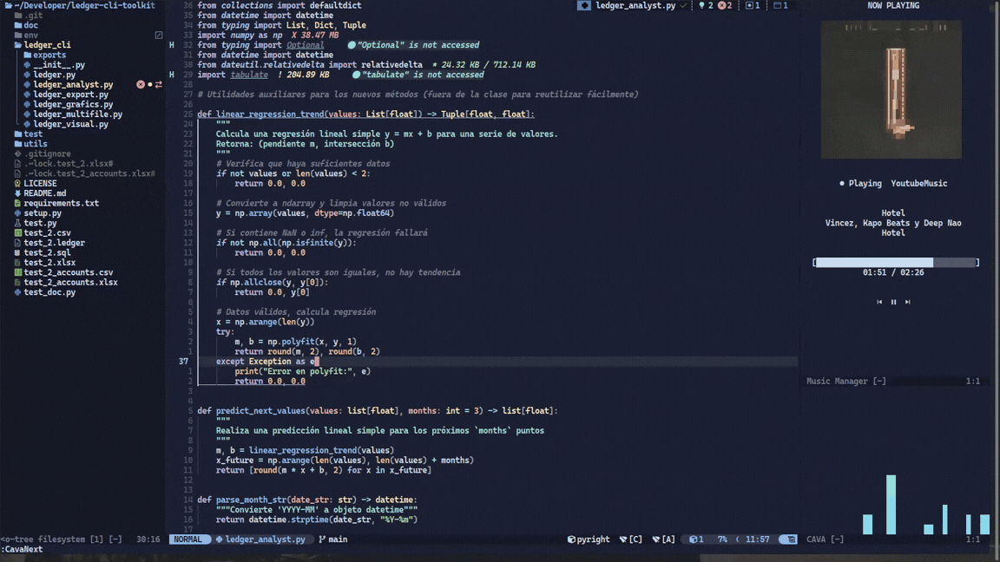

<h1 align="center">cava.nvim</h1>

<p align="center">A music player and audio visualizer for Neovim</p>

<p align="center">
 
 
 
 
 
</p>

A Neovim plugin that brings music playback information, album artwork, playback controls, and a real-time CAVA audio visualizer directly into your editor.

> **Early development**
>
> `cava.nvim` is currently in its first version. The plugin is functional, but it is still being actively developed and polished. Some parts of the architecture, rendering system, and user interface may change as the project evolves.







## Purpose

The idea behind **cava.nvim** started from a simple question:

> Why should I leave Neovim just to check or control my music?

The goal of the project is to provide a small music interface directly inside Neovim, allowing you to see what is currently playing, control playback, view album artwork, and enjoy an audio visualizer without switching to another application.

The plugin communicates with external tools such as **Playerctl**, **CAVA**, **Python**, and **Chafa**, while Neovim provides the user interface.

The architecture is intentionally separated into independent components so that each subsystem can evolve independently.

## Features

### Current Features

- [x] **Music information** — Displays the current track, artist, album, playback state, position, and duration.
- [x] **Playback controls** — Play, pause, toggle playback, next track, and previous track.
- [x] **Playerctl integration** — Uses MPRIS through Playerctl to communicate with compatible media players.
- [x] **Real-time CAVA visualizer** — Displays audio frequency bars directly inside Neovim.
- [x] **Album artwork** — Retrieves artwork URLs from the media player and downloads the images asynchronously.
- [x] **Artwork caching** — Avoids downloading the same artwork repeatedly.
- [x] **Terminal artwork rendering** — Uses Chafa to convert album artwork into terminal-compatible ANSI output.
- [x] **Asynchronous backend** — The Python server runs independently from Neovim's main UI loop.
- [x] **Configurable player source** — Playerctl can be configured to use the MPRIS player you need.
- [x] **Configurable UI** — Music labels, controls, progress bars, artwork dimensions, window behavior, and other visual elements can be customized.
- [x] **Automatic server lifecycle** — The backend server can be started and monitored automatically by the plugin.

### Tested Setup

The first version of the plugin was specifically tested with **YouTube Music running through [Pear Desktop](https://github.com/pear-devs/pear-desktop)**.

Pear Desktop is **not required** by `cava.nvim`.

The important requirement is that the music player exposes an MPRIS interface that can be accessed through Playerctl.

This means that other compatible players can potentially be used by changing the `playerctl.provider` option.

For example:

```lua
playerctl = {
    provider = "YoutubeMusic",
    command = "playerctl",
}
```

You can find the available Playerctl players with:

```bash
playerctl -l
```

Then use the corresponding player name in your configuration.

## Requirements

The plugin relies on several external programs.

### Neovim

A recent version of Neovim is recommended.

The plugin uses Neovim's Lua APIs, asynchronous callbacks, timers, buffers, windows, and HTTP communication with the backend.

### Python

**Python 3** is required for the backend server.

The Python backend is responsible for functionality that is easier to isolate outside Neovim, including:

- CAVA process management.
- Playerctl metadata monitoring.
- Artwork downloading and caching.
- Image inspection.
- Image size calculations.
- Chafa rendering.
- HTTP API communication with Neovim.

Check your Python installation with:

```bash
python3 --version
```

The Python executable can be configured:

```lua
server = {
    python = "python3",
}
```

### CAVA

**CAVA** is the audio visualizer used by the plugin.

It analyzes the system's audio input and produces the frequency data used to draw the visualizer inside Neovim.

Check your installation with:

```bash
cava -v
```

The plugin currently uses CAVA's raw output mode to receive numerical audio frames.

CAVA's input configuration can be customized:

```lua
cava = {
    framerate = 60,
    bars = 24,
    input_method = "pulse",
    input_source = "auto",
}
```

### Playerctl

**Playerctl** is used to communicate with media players through the **MPRIS** interface.

It provides:

- Current track metadata.
- Playback status.
- Track position.
- Track duration.
- Album artwork URL.
- Play/pause controls.
- Previous/next track controls.

Check your installation with:

```bash
playerctl --version
```

List available media players with:

```bash
playerctl -l
```

Then configure the desired player:

```lua
playerctl = {
    provider = "YoutubeMusic",
    command = "playerctl",
}
```

The `provider` value depends on the media player available on your system.

### Chafa

**Chafa** is used to render album artwork inside terminals that do not provide native image rendering.

It converts regular image files into terminal-compatible ANSI/symbol output.

Check your installation with:

```bash
chafa --version
```

`cava.nvim` uses Chafa for terminal artwork rendering while taking the terminal's font aspect ratio into account.

## Installation

### lazy.nvim

```lua
{
    "EddyBel/cava.nvim",

    opts = {},
}
```

### packer.nvim

```lua
use {
    "EddyBel/cava.nvim",

    config = function()
        require("cava").setup()
    end,
}
```

### Native Packages (`vim.packadd`)

```lua
vim.pack.add({
    "https://github.com/EddyBel/cava.nvim",
})
```

Then add the following to your `init.lua`:

```lua
require("cava").setup()
```

## Configuration

`cava.nvim` is designed so that each subsystem owns its own default configuration.

This means you only need to override the options you want to change.

A complete configuration example is shown below:

```lua
{
    "EddyBel/cava.nvim",

    opts = {
        -- ============================================================
        -- SERVER
        -- ============================================================

        server = {
            host = "127.0.0.1",
            port = 9092,
            python = "python3",

            startup_timeout = 5,
            check_interval = 100,
            parent_check_interval = 1.0,

            player = {
                provider = "YoutubeMusic",
                command = "playerctl",
            },

            cava = {
                framerate = 60,
                bars = 24,
                input_method = "pulse",
                input_source = "auto",
            },
        },

        -- ============================================================
        -- PLAYERCTL
        -- ============================================================

        playerctl = {
            provider = "YoutubeMusic",
            command = "playerctl",

            interval = 500,
        },

        -- ============================================================
        -- CAVA
        -- ============================================================

        cava = {
            framerate = 60,
            bars = 24,

            input_method = "pulse",
            input_source = "auto",

            interval = 33,
        },

        -- ============================================================
        -- ARTWORK
        -- ============================================================

        artwork = {
            enabled = true,

            placeholder = "@",

            font_ratio = "1/2",

            max_width = 28,
            max_height = 18,

            highlight = "CavaArtwork",
        },

        -- ============================================================
        -- BUFFER
        -- ============================================================

        buffer = {
            manager_name = "Music Manager",

            max_width = 40,
            min_width = 20,
            width = 35,

            manager = {
                buftype = "nofile",
                bufhidden = "hide",
                swapfile = false,
            },

            cava_name = "CAVA",

            cava = {
                buftype = "nofile",
                bufhidden = "wipe",
                swapfile = false,

                max_height = 15,
            },

            music = {
                title = "NOW PLAYING",

                empty_title = "No music playing",
                empty_artist = "Unknown artist",
                empty_album = "Unknown album",

                padding = 2,
                spacing = 2,

                controls = {
                    previous = "󰒮",
                    play = "󰐊",
                    pause = "󰏤",
                    next = "󰒭",
                },

                status_icons = {
                    Playing = "●",
                    Paused = "Ⅱ",
                    Stopped = "■",
                },

                progress = {
                    filled = "█",
                    empty = "░",
                    left = "[",
                    right = "]",
                },

                artwork = {
                    enabled = true,

                    placeholder = "@",

                    highlight = "CavaArtwork",

                    max_width = 28,
                    max_height = 18,
                },
            },

            wrap = false,
            number = false,
            relativenumber = false,

            cursorline = false,
            cursorcolumn = false,

            signcolumn = "no",
            colorcolumn = "",

            resize = true,
            persistent = true,
        },
    },
}
```

### Configuration Options

| Option                         | Type      | Description                                               |
| ------------------------------ | --------- | --------------------------------------------------------- |
| `server.host`                  | `string`  | Address where the Python backend listens.                 |
| `server.port`                  | `number`  | TCP port used by the backend.                             |
| `server.python`                | `string`  | Python executable used to start the backend.              |
| `server.startup_timeout`       | `number`  | Maximum time in seconds allowed for the backend to start. |
| `server.check_interval`        | `number`  | Server availability check interval in milliseconds.       |
| `server.parent_check_interval` | `number`  | Backend parent-process check interval in seconds.         |
| `playerctl.provider`           | `string`  | MPRIS player controlled by the plugin.                    |
| `playerctl.command`            | `string`  | Playerctl executable.                                     |
| `playerctl.interval`           | `number`  | Metadata update interval in milliseconds.                 |
| `cava.framerate`               | `number`  | Number of audio frames generated per second.              |
| `cava.bars`                    | `number`  | Number of visualizer bars.                                |
| `cava.input_method`            | `string`  | Audio input backend used by CAVA.                         |
| `cava.input_source`            | `string`  | Audio source passed to CAVA.                              |
| `cava.interval`                | `number`  | Interval in milliseconds for requesting new CAVA frames.  |
| `artwork.enabled`              | `boolean` | Enables or disables artwork rendering.                    |
| `artwork.placeholder`          | `string`  | Character displayed while artwork is unavailable.         |
| `artwork.font_ratio`           | `string`  | Terminal font aspect ratio used for image sizing.         |
| `artwork.max_width`            | `number`  | Maximum artwork width in terminal cells.                  |
| `artwork.max_height`           | `number`  | Maximum artwork height in terminal cells.                 |
| `artwork.highlight`            | `string`  | Neovim highlight group used by artwork rendering.         |
| `buffer.manager_name`          | `string`  | Name of the main music manager buffer.                    |
| `buffer.max_width`             | `number`  | Maximum width of the music panel.                         |
| `buffer.min_width`             | `number`  | Minimum width of the music panel.                         |
| `buffer.width`                 | `number`  | Preferred width of the music panel.                       |
| `buffer.cava_name`             | `string`  | Name of the CAVA buffer.                                  |
| `buffer.cava.max_height`       | `number`  | Maximum height of the CAVA visualizer.                    |
| `buffer.music.title`           | `string`  | Main title displayed by the music manager.                |
| `buffer.music.empty_title`     | `string`  | Text shown when no track is playing.                      |
| `buffer.music.empty_artist`    | `string`  | Fallback text for missing artist metadata.                |
| `buffer.music.empty_album`     | `string`  | Fallback text for missing album metadata.                 |
| `buffer.music.padding`         | `number`  | Internal spacing around music elements.                   |
| `buffer.music.spacing`         | `number`  | Spacing between music interface elements.                 |
| `buffer.music.controls`        | `table`   | Symbols used for playback controls.                       |
| `buffer.music.status_icons`    | `table`   | Icons used for playback states.                           |
| `buffer.music.progress`        | `table`   | Characters used to construct the progress bar.            |
| `buffer.music.artwork`         | `table`   | Artwork configuration specific to the music panel.        |
| `buffer.wrap`                  | `boolean` | Enables line wrapping.                                    |
| `buffer.number`                | `boolean` | Enables absolute line numbers.                            |
| `buffer.relativenumber`        | `boolean` | Enables relative line numbers.                            |
| `buffer.cursorline`            | `boolean` | Highlights the current line.                              |
| `buffer.cursorcolumn`          | `boolean` | Highlights the current column.                            |
| `buffer.signcolumn`            | `string`  | Controls the Neovim sign column.                          |
| `buffer.colorcolumn`           | `string`  | Configures Neovim's color column.                         |
| `buffer.resize`                | `boolean` | Automatically resizes the plugin layout.                  |
| `buffer.persistent`            | `boolean` | Keeps plugin buffers alive while hidden.                  |

## Commands

### Interface

| Command       | Description                          |
| ------------- | ------------------------------------ |
| `:CavaOpen`   | Opens the Music Manager interface.   |
| `:CavaClose`  | Closes the Music Manager interface.  |
| `:CavaToggle` | Toggles the Music Manager interface. |

### Playback

| Command          | Description                                  |
| ---------------- | -------------------------------------------- |
| `:CavaPlay`      | Starts playback.                             |
| `:CavaPause`     | Pauses playback.                             |
| `:CavaPlayPause` | Toggles playback between playing and paused. |
| `:CavaNext`      | Plays the next track.                        |
| `:CavaPrevious`  | Plays the previous track.                    |

The playback commands communicate with the backend asynchronously, so they do not intentionally block Neovim while waiting for the server response.

## How It Works

The plugin is composed of several independent components:

```text
                         Neovim
                            │
                            ▼
                     ┌─────────────┐
                     │  cava.nvim  │
                     └──────┬──────┘
                            │
                    HTTP / JSON API
                            │
                            ▼
                     ┌─────────────┐
                     │ Python      │
                     │ Backend     │
                     └──────┬──────┘
                            │
              ┌─────────────┼─────────────┐
              │             │             │
              ▼             ▼             ▼
         ┌─────────┐   ┌──────────┐   ┌─────────┐
         │ CAVA    │   │ Playerctl│   │ Chafa   │
         └────┬────┘   └─────┬────┘   └────┬────┘
              │              │             │
              │              │             │
              ▼              ▼             ▼
          Audio data     Music data    Image output
                             │
                             ▼
                         Artwork
```

### CAVA

CAVA analyzes the system audio and continuously produces frequency information.

The backend reads these frames and exposes them through the local HTTP API.

Neovim periodically retrieves the latest frame and updates the visualizer buffer.

### Playerctl

Playerctl communicates with the media player through MPRIS.

The plugin can retrieve metadata such as:

- Title
- Artist
- Album
- Playback status
- Current position
- Duration
- Artwork URL

It can also send playback commands.

### Artwork

When the current track provides an artwork URL, the backend downloads the image asynchronously.

The image is stored in a local cache so that it does not need to be downloaded repeatedly.

When a new track starts, the artwork cache is checked and the new image is rendered when available.

### Chafa

Chafa converts the local artwork image into terminal-compatible output.

This allows album artwork to be displayed even in terminals without native image protocols.

## Current Limitations

This is the **first version** of `cava.nvim`, so there are still several areas that need improvement.

Some parts of the plugin have only been tested in a limited environment.

In particular:

- The primary tested media source is YouTube Music through Pear Desktop.
- Other MPRIS-compatible players have not been tested extensively yet.
- Terminal image rendering currently relies on Chafa.
- Native terminal image protocols are not implemented yet.
- The UI is still evolving.
- Some configuration options may change as the architecture stabilizes.
- More extensive testing across terminals, operating systems, and media players is still needed.

## Roadmap

### Media Sources

- [ ] Test and support additional MPRIS-compatible media players.
- [ ] Improve player detection.
- [ ] Improve handling of multiple simultaneously available players.
- [ ] Provide better automatic player selection.

### Image Rendering

- [ ] Support native terminal image protocols where available.
- [ ] Detect terminals capable of displaying real images.
- [ ] Render actual images instead of relying exclusively on ANSI/symbol rendering.
- [ ] Provide different rendering backends depending on terminal capabilities.

### User Interface

- [ ] Improve the visual layout.
- [ ] Improve artwork transitions.
- [ ] Add more customization options.
- [ ] Improve responsive behavior when the Neovim window is resized.

### Interaction

- [ ] Add mouse/touch-oriented controls where supported.
- [ ] Improve interaction with the music controls.
- [ ] Explore touch input support for compatible terminal environments.

### Alpha.nvim

- [ ] Add integration with **alpha-nvim**.
- [ ] Explore displaying the current music state and visualizer inside the Neovim start screen.
- [ ] Provide optional music widgets for Alpha.

## Why the Project Exists

`cava.nvim` started as a personal experiment.

I spend a significant amount of time inside Neovim, and I wanted to be able to see what I was listening to without constantly switching between Neovim and my music player.

The initial idea was simply to create a small music monitor inside Neovim.

From there, the project evolved into a combination of:

- Music metadata.
- Playback controls.
- Album artwork.
- Audio visualization.
- A Python backend.
- Terminal image rendering.
- A configurable Neovim interface.

The project is still evolving, but the long-term goal is to make Neovim capable of acting as a small, extensible music dashboard.

## Contributing

Contributions, bug reports, feature requests, and pull requests are welcome!

Since this project is still in its early stages, feedback is especially useful.

If you use a different media player, terminal, operating system, or terminal image protocol, testing and reporting compatibility would be greatly appreciated.

Feel free to open an issue or submit a pull request on GitHub.

## License

This project is open-source software licensed under the [MIT](./LICENSE) license.

---

<p align="center">
  <a href="https://github.com/EddyBel" target="_blank">
    
  </a>
  <a href="https://www.linkedin.com/in/eduardo-rangel-eddybel/" target="_blank">
    
  </a>
</p>
