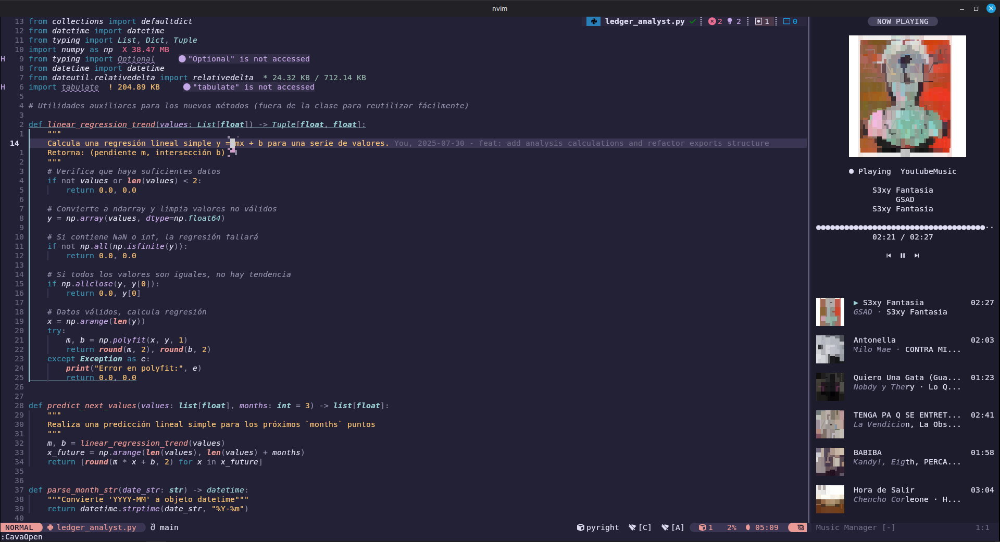
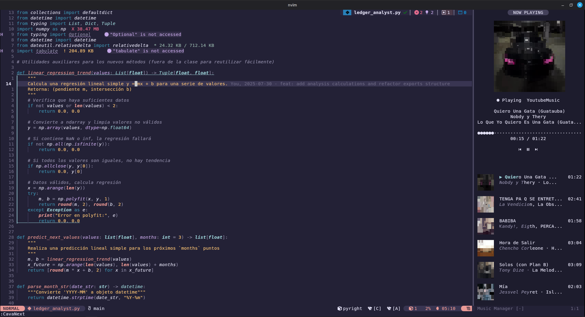
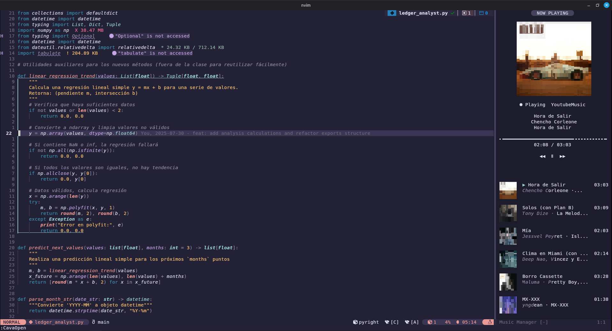
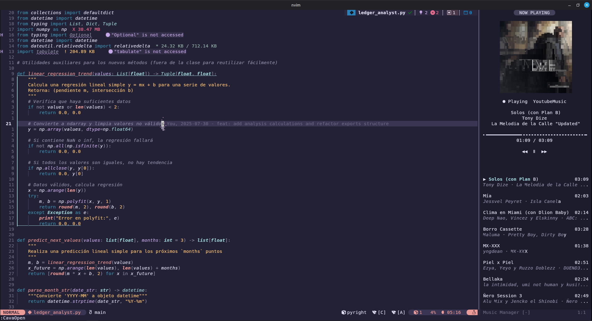
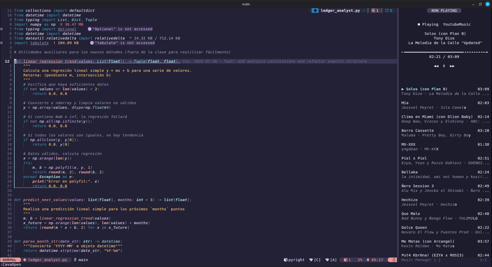
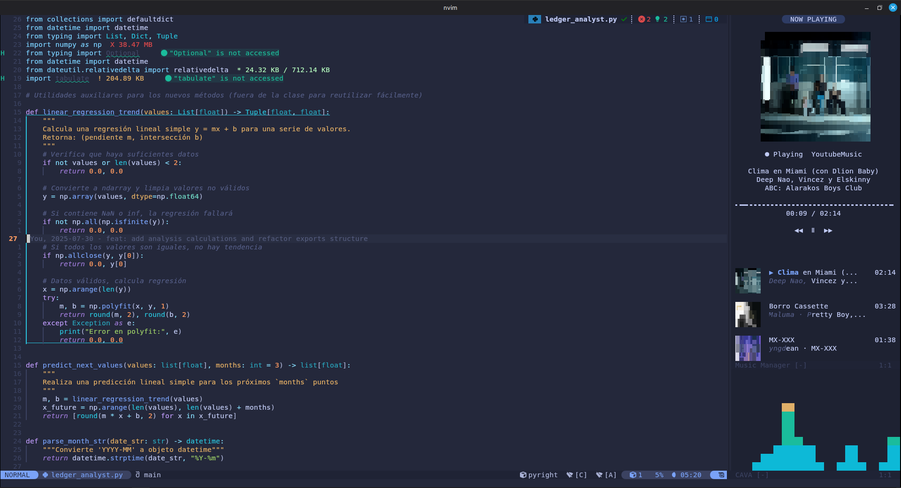

<h1 align="center">cava.nvim</h1>

<p align="center">A music player and audio visualizer for Neovim</p>

<p align="center">
 
 
 
 
 
</p>

`cava.nvim` is a music player interface and audio visualizer for Neovim.

It provides music information, playback controls, album artwork, tracklists, track thumbnails, and an optional real-time CAVA visualizer directly inside Neovim.

The plugin uses a Python backend to communicate with external media services and system utilities while Neovim handles the user interface.










## Purpose

The idea behind **cava.nvim** started from a simple question:

> Why should I leave Neovim just to check or control my music?

The goal is to provide a small and extensible music interface directly inside Neovim.

Instead of switching between the editor and a separate music application, `cava.nvim` allows you to:

- See what is currently playing.
- Control playback.
- View album artwork.
- Browse the current tracklist.
- Display track thumbnails.
- Control volume, shuffle, and repeat modes.
- View playback progress.
- Display a real-time audio visualizer.

The architecture separates the Neovim interface from the Python backend and media providers, allowing each component to evolve independently.

## Features

### Music

- [x] **Music information** — Displays the current track, artist, album, playback state, position, and duration.
- [x] **Playback controls** — Play, pause, toggle playback, stop, next track, and previous track.
- [x] **Seek controls** — Seek relative to the current position and set an exact playback position.
- [x] **Volume controls** — Set, increase, and decrease playback volume.
- [x] **Shuffle control** — Enable, disable, and toggle shuffle.
- [x] **Loop control** — Disable repeat, repeat the current track, or repeat the playlist.
- [x] **Music provider selection** — Select, automatically detect, and cycle between music providers.

### Tracklist

- [x] **Tracklist support** — Retrieves the current playlist/queue when the selected music source provides it.
- [x] **Tracklist navigation** — Displays the current and upcoming tracks.
- [x] **Track thumbnails** — Retrieves and displays individual track artwork when available.
- [x] **Configurable tracklist artwork** — Tracklist thumbnails can be enabled or disabled independently from the main artwork.
- [x] **Artwork source selection** — Tracklist thumbnails can use rendered artwork or a generic placeholder.
- [x] **Upcoming tracklist mode** — Optionally hides already played tracks.
- [x] **Tracklist placeholders** — Displays a configurable placeholder while playlist information is unavailable.

### Artwork

- [x] **Album artwork** — Retrieves artwork from supported media sources.
- [x] **Asynchronous artwork loading** — Artwork is downloaded without blocking Neovim.
- [x] **Artwork caching** — Avoids downloading the same artwork repeatedly.
- [x] **Terminal artwork rendering** — Uses Chafa to convert images into terminal-compatible output.
- [x] **Configurable artwork dimensions** — Artwork size can be adjusted independently of the music panel.

### Audio Visualization

- [x] **Real-time CAVA visualizer** — Displays audio frequency bars directly inside Neovim.
- [x] **Configurable CAVA rendering** — FPS, number of bars, height, and update behavior can be configured.
- [x] **Optional CAVA support** — The visualizer can be completely disabled if CAVA is not installed or not required.

### Backend

- [x] **Python backend** — Runs media and visualization operations outside Neovim's main UI loop.
- [x] **HTTP communication** — Neovim communicates with the backend through a local HTTP API.
- [x] **Automatic server lifecycle** — The backend can be started, monitored, and stopped automatically.
- [x] **Provider abstraction** — Media sources are isolated from the Neovim interface.
- [x] **Asynchronous operations** — Network, artwork, and backend operations do not intentionally block the Neovim UI.

## Media Sources

`cava.nvim` currently provides two main ways of communicating with media players.

### Pear Desktop

Native support is available for **Pear Desktop**, an application that provides YouTube Music functionality on the desktop.

Original project:

[Pear Desktop — GitHub](https://github.com/pear-devs/pear-desktop?utm_source=chatgpt.com)

This integration communicates directly with Pear Desktop's API instead of relying exclusively on Playerctl.

This allows `cava.nvim` to obtain richer information from the application, including information that may not be available through a generic MPRIS interface.

#### Enabling the Pear Desktop API

To use the native Pear Desktop integration:

1. Open **Pear Desktop**.
2. Open the application's **Plugins** section.
3. Locate **Servidor API**.
4. Enable **Servidor API**.
5. Make sure the API server is running.
6. Configure `cava.nvim` to use the YouTube Music provider.

Example:

```lua
server = {
    player = {
        provider = "YoutubeMusic",
    },

    youtube_music = {
        url = "http://localhost:26538",
    },
}
```

The API URL must match the address configured by Pear Desktop.

When the YouTube Music provider is selected, `cava.nvim` first attempts to use the native Pear Desktop API.

If the native backend is unavailable, the music system can fall back to the generic Playerctl backend when applicable.

Pear Desktop is **not required** to use `cava.nvim`.

### Playerctl

**Playerctl** is supported as the generic media source.

Playerctl communicates with media players through the **MPRIS** interface available on Linux.

This makes it possible to use `cava.nvim` with many different media players without implementing a dedicated integration for each one.

Examples include media players and applications that expose MPRIS metadata and controls through Playerctl.

List the available players with:

```bash
playerctl -l
```

A specific provider can then be selected:

```lua
server = {
    player = {
        provider = "firefox",
        command = "playerctl",
    },
}
```

The resulting Playerctl command uses the selected provider:

```bash
playerctl -p firefox
```

For YouTube Music/Pear Desktop, the special provider names are handled by the native YouTube Music backend.

## Requirements

### Neovim

`cava.nvim` requires:

**Neovim 0.12 or newer.**

The plugin uses modern Neovim Lua APIs, asynchronous operations, timers, buffers, windows, namespaces, and rendering functionality.

Using the latest stable Neovim version is recommended.

Check your version with:

```bash
nvim --version
```

### Python

**Python 3** is required for the backend server.

The Python backend is responsible for:

- Media provider communication.
- HTTP API communication.
- Artwork downloading.
- Artwork caching.
- Image inspection.
- Image dimensions.
- Chafa rendering.
- CAVA process management.
- Playerctl integration.

Check your installation:

```bash
python3 --version
```

The Python executable can be configured:

```lua
server = {
    python = "python3",
}
```

### Chafa

**Chafa is required for artwork rendering.**

Chafa is used to convert album artwork and track thumbnails into terminal-compatible ASCII/Unicode representations.

This allows artwork to be displayed inside Neovim without requiring native terminal image protocols.

Check your installation:

```bash
chafa --version
```

### Playerctl

**Playerctl is optional but recommended as a generic media source.**

It provides a universal interface for media players that expose an MPRIS interface.

It is especially useful when using a media player that does not have a dedicated native provider in `cava.nvim`.

Check your installation:

```bash
playerctl --version
```

List available players:

```bash
playerctl -l
```

`cava.nvim` does not require Playerctl when using a native provider that communicates directly with its application API.

### CAVA

**CAVA is completely optional.**

CAVA is only required when the audio visualizer is enabled.

If you do not need the visualizer, CAVA can be disabled in the Neovim configuration and does not need to be installed.

Enable the visualizer:

```lua
cava = {
    enabled = true,
}
```

Disable it:

```lua
cava = {
    enabled = false,
}
```

When CAVA is enabled, the `cava` executable must be available in the system.

Check the installation:

```bash
cava -v
```

## Installation

### lazy.nvim

```lua
{
    "EddyBel/cava.nvim",
    opts = {},
}
```

### packer.nvim

```lua
use {
    "EddyBel/cava.nvim",

    config = function()
        require("cava").setup()
    end,
}
```

### Native Packages (`vim.pack`)

```lua
vim.pack.add({
    "https://github.com/EddyBel/cava.nvim",
})
```

Then initialize the plugin:

```lua
require("cava").setup()
```

## Configuration

`cava.nvim` uses a modular configuration.

Each subsystem has its own configuration section:

```text
opts
├── server
├── menu
├── player
├── cava
└── poller
```

A complete configuration example:

```lua
{
    "EddyBel/cava.nvim",
    opts = {
        server = {
            host = "127.0.0.1",
            port = 9092,
            python = "python3",
            player = {
                -- Logical provider.
                --
                -- YoutubeMusic / YoutubeMusic Pear-Desktop API:
                --     YoutubeMusicProvider
                --
                -- Any other value:
                --     playerctl -p <provider>
                --
                provider = "YoutubeMusic",
                -- playerctl executable.
                command = "playerctl",
            },
            youtube_music = {
                -- Youtube Music Pear-Desktop URI API
                url = "http://localhost:26538",
            },
        },
        menu = {
            max_width = 40,
            min_width = 20,
            width = 30,
            resize = true,
            persistent = true,
        },
        player = {
            name = "Music Manager",
            buftype = "nofile",
            bufhidden = "hide",
            swapfile = false,

            background = {
                --- Si es `false`, la ventana usa el fondo normal del editor.
                enabled = true,
                --- Cuánto oscurecer el fondo respecto a "Normal": 0 = igual,
                --- 1 = negro absoluto. 0.15 es un valor sutil, similar a lo que
                --- usan plugins como neo-tree.
                darken = 0.15,
                --- Nombre del highlight group generado internamente.
                highlight_group = "CavaPlayerNormal",
            },

            window = {
                wrap = false,
                number = false,
                relativenumber = false,
                cursorline = false,
                cursorcolumn = false,
                signcolumn = "no",
                colorcolumn = "",
            },

            music = {
                title = "NOW PLAYING",

                title_style = {
                    enabled = true,
                    left = '',
                    right = '',
                    padding = 1,
                    highlight_group = "CavaPlayerTitle",
                    foreground = nil,
                    background = "Visual",
                },

                empty_title = "▀▀▀▀▀▀▀▀▀▀▀▀▀▀▀▀",
                empty_artist = "▀▀▀▀▀▀▀▀▀▀",
                empty_album = "▀▀▀▀▀▀",

                padding = 1,
                spacing = 1,

                controls = {
                    previous = "󰒮",
                    play = "󰐊",
                    pause = "󰏤",
                    next = "󰒭",
                },

                status_icons = {
                    Playing = "●",
                    Paused = "Ⅱ",
                    Stopped = "■",
                },

                progress = {
                    filled = "●",
                    empty = "·",
                    left = "",
                    right = "",
                },
                artwork = {
                    enabled = true,
                    placeholder = "█",
                    highlight = "CavaArtwork",

                    max_width = 28,
                    max_height = 13,
                },

                tracklist = {
                    enabled = true,
                    view_mode = "upcoming",

                    spacing = 1,
                    item_spacing = 1,

                    thumbnail_width = 6,
                    thumbnail_height = 3,
                    thumbnail_gap = 2,

                    duration_gap = 2,

                    placeholder = "▀▀",

                    selected = "▶",

                    selected_highlight = "Title",
                    title_highlight = "Normal",
                    metadata_highlight = "Comment",
                    duration_highlight = "Comment",

                    artwork = {
                        enabled = true,
                        source = "image",
                    },

                    empty_placeholder = {
                        enabled = true,
                        items = 7,
                        title = "No tracklist available",
                        artist = "Waiting for playlist data...",
                        fake_title = "▀▀▀▀▀▀",
                        fake_metadata = "▀▀▀▀▀▀▀▀▀▀▀▀",
                        fake_duration = "--:--"
                    },
                },
            },
        },

        cava = {
            enabled = false,
            background = {
                enabled = true,
                darken = 0.15,
                highlight_group = "CavaPlayerNormal",
            },

            fps = 30,
            delay_ms = 90,

            max_inflight = 3,
            min_request_interval = 0,
            max_buffered_frames = 12,

            debug = false,
            max_height = 12,
        },

        poller = {
            player_interval = 1000,
            retry_interval = 100,
        },

        artwork = {
            enabled = true,
        },

        tracklist_artwork = {
            enabled = true,
        },
    }
},
```

## Configuration

`cava.nvim` can be configured through the `opts` table passed to `setup()`.

```lua
require("cava").setup({
    -- configuration
})
```

The configuration is divided into several sections, each responsible for a specific part of the plugin.

---

### Server

Controls the local Python HTTP server and the media backends used by `cava.nvim`.

| Option                     | Values    | Description                                                                                                                                                               |
| :------------------------- | :-------- | :------------------------------------------------------------------------------------------------------------------------------------------------------------------------ |
| `server.host`              | `string`  | Host address where the Python server listens.                                                                                                                             |
| `server.port`              | `integer` | Port used by the Python HTTP server.                                                                                                                                      |
| `server.python`            | `string`  | Python executable used to start the backend.                                                                                                                              |
| `server.player.provider`   | `string`  | Logical media provider to use. `YoutubeMusic` / `YoutubeMusic Pear-Desktop API` use the YouTube Music backend; any other value is passed to Playerctl as `-p <provider>`. |
| `server.player.command`    | `string`  | Playerctl executable or command used by the generic media backend.                                                                                                        |
| `server.youtube_music.url` | `string`  | URL of the YouTube Music Pear Desktop API server.                                                                                                                         |

#### Provider Values

The `server.player.provider` option determines which media backend is used.

| Value                             | Backend       | Description                                                  |
| :-------------------------------- | :------------ | :----------------------------------------------------------- |
| `"YoutubeMusic"`                  | YouTube Music | Uses the YouTube Music backend.                              |
| `"YoutubeMusic Pear-Desktop API"` | YouTube Music | Uses the Pear Desktop API.                                   |
| `<player>`                        | Playerctl     | Uses `playerctl -p <player>` for an MPRIS-compatible player. |

For example:

```lua
server = {
    player = {
        provider = "firefox",
        command = "playerctl",
    },
}
```

This makes the backend use:

```bash
playerctl -p firefox
```

---

### Menu

Controls the dimensions and lifecycle behavior of the Music Manager interface.

| Option            | Values    | Description                                                                |
| :---------------- | :-------- | :------------------------------------------------------------------------- |
| `menu.max_width`  | `integer` | Maximum width allowed for the Music Manager window.                        |
| `menu.min_width`  | `integer` | Minimum width allowed for the Music Manager window.                        |
| `menu.width`      | `integer` | Initial or preferred width of the Music Manager window.                    |
| `menu.resize`     | `boolean` | Automatically resize the interface according to the configured dimensions. |
| `menu.persistent` | `boolean` | Keep the interface state available when the window is closed and reopened. |

---

### Player

Controls the Music Manager buffer, window appearance, music information, artwork, controls, progress bar, and tracklist.

#### Buffer

| Option             | Values    | Description                                                         |
| :----------------- | :-------- | :------------------------------------------------------------------ |
| `player.name`      | `string`  | Name used for the Music Manager buffer.                             |
| `player.buftype`   | `string`  | Neovim buffer type used by the Music Manager.                       |
| `player.bufhidden` | `string`  | Determines what happens to the buffer when it is hidden.            |
| `player.swapfile`  | `boolean` | Enables or disables swapfile creation for the Music Manager buffer. |

#### Background

Controls the background appearance of the Music Manager.

| Option                              | Values         | Description                                                                                                           |
| :---------------------------------- | :------------- | :-------------------------------------------------------------------------------------------------------------------- |
| `player.background.enabled`         | `boolean`      | Enable or disable the custom background. When `false`, the normal editor background is used.                          |
| `player.background.darken`          | `number` `0–1` | Amount by which the background is darkened. `0` keeps the original background; `1` produces a fully black background. |
| `player.background.highlight_group` | `string`       | Name of the highlight group generated internally for the Music Manager background.                                    |

Example:

```lua
background = {
    enabled = true,
    darken = 0.15,
    highlight_group = "CavaPlayerNormal",
}
```

---

#### Window

Controls standard Neovim window options used by the Music Manager.

| Option                         | Values    | Description                      |
| :----------------------------- | :-------- | :------------------------------- |
| `player.window.wrap`           | `boolean` | Enable or disable line wrapping. |
| `player.window.number`         | `boolean` | Show absolute line numbers.      |
| `player.window.relativenumber` | `boolean` | Show relative line numbers.      |
| `player.window.cursorline`     | `boolean` | Highlight the current line.      |
| `player.window.cursorcolumn`   | `boolean` | Highlight the current column.    |
| `player.window.signcolumn`     | `string`  | Configure the sign column.       |
| `player.window.colorcolumn`    | `string`  | Configure the color column.      |

---

### Music

Controls the content and visual presentation of the currently playing track.

| Option                      | Values    | Description                                        |
| :-------------------------- | :-------- | :------------------------------------------------- |
| `player.music.title`        | `string`  | Title displayed in the Music Manager header.       |
| `player.music.empty_title`  | `string`  | Placeholder title shown when no music is playing.  |
| `player.music.empty_artist` | `string`  | Placeholder artist shown when no music is playing. |
| `player.music.empty_album`  | `string`  | Placeholder album shown when no music is playing.  |
| `player.music.padding`      | `integer` | Horizontal padding applied to the music content.   |
| `player.music.spacing`      | `integer` | Vertical spacing between music sections.           |

---

### Music — Title Style

Controls the optional styled title displayed at the top of the Music Manager.

| Option                                     | Values          | Description                                                                         |
| :----------------------------------------- | :-------------- | :---------------------------------------------------------------------------------- |
| `player.music.title_style.enabled`         | `boolean`       | Enable or disable the styled title.                                                 |
| `player.music.title_style.left`            | `string`, `nil` | Character displayed on the left side of the title.                                  |
| `player.music.title_style.right`           | `string`, `nil` | Character displayed on the right side of the title.                                 |
| `player.music.title_style.padding`         | `integer`       | Number of spaces between the side characters and title text.                        |
| `player.music.title_style.highlight_group` | `string`        | Base highlight group used for the title background and foreground.                  |
| `player.music.title_style.foreground`      | `string`, `nil` | Foreground color. Can be a hexadecimal color or an existing Neovim highlight group. |
| `player.music.title_style.background`      | `string`, `nil` | Background color. Can be a hexadecimal color or an existing Neovim highlight group. |

Colors can be specified as hexadecimal values:

```lua
foreground = "#FFFFFF",
background = "#1E1E2E",
```

or by referencing an existing Neovim highlight group:

```lua
foreground = "Normal",
background = "Visual",
```

Example:

```lua
title_style = {
    enabled = true,
    left = "",
    right = "",
    padding = 1,
    highlight_group = "CavaPlayerTitle",
    foreground = nil,
    background = "Visual",
}
```

---

### Music — Controls

Defines the symbols used for playback controls.

| Option                           | Values   | Description                                      |
| :------------------------------- | :------- | :----------------------------------------------- |
| `player.music.controls.previous` | `string` | Symbol displayed for the previous-track control. |
| `player.music.controls.play`     | `string` | Symbol displayed for the play control.           |
| `player.music.controls.pause`    | `string` | Symbol displayed for the pause control.          |
| `player.music.controls.next`     | `string` | Symbol displayed for the next-track control.     |

---

### Music — Status Icons

Defines the icon displayed for each playback state.

| Option                              | Values   | Description                                 |
| :---------------------------------- | :------- | :------------------------------------------ |
| `player.music.status_icons.Playing` | `string` | Icon displayed while the player is playing. |
| `player.music.status_icons.Paused`  | `string` | Icon displayed while playback is paused.    |
| `player.music.status_icons.Stopped` | `string` | Icon displayed when playback is stopped.    |

---

### Music — Progress

Controls the playback progress bar.

| Option                         | Values   | Description                                                   |
| :----------------------------- | :------- | :------------------------------------------------------------ |
| `player.music.progress.filled` | `string` | Character used for the completed portion of the progress bar. |
| `player.music.progress.empty`  | `string` | Character used for the remaining portion.                     |
| `player.music.progress.left`   | `string` | Character displayed at the beginning of the progress bar.     |
| `player.music.progress.right`  | `string` | Character displayed at the end of the progress bar.           |

Example:

```lua
progress = {
    filled = "●",
    empty = "·",
    left = "",
    right = "",
}
```

---

### Music — Artwork

Controls the main album artwork displayed for the currently playing track.

| Option                             | Values    | Description                                 |
| :--------------------------------- | :-------- | :------------------------------------------ |
| `player.music.artwork.enabled`     | `boolean` | Enable or disable album artwork.            |
| `player.music.artwork.placeholder` | `string`  | Character used when artwork is unavailable. |
| `player.music.artwork.highlight`   | `string`  | Highlight group used for rendered artwork.  |
| `player.music.artwork.max_width`   | `integer` | Maximum artwork width.                      |
| `player.music.artwork.max_height`  | `integer` | Maximum artwork height.                     |

---

### Music — Tracklist

Controls the playlist/tracklist displayed below the current track information.

| Option                                      | Values                 | Description                                                          |
| :------------------------------------------ | :--------------------- | :------------------------------------------------------------------- |
| `player.music.tracklist.enabled`            | `boolean`              | Enable or disable the tracklist.                                     |
| `player.music.tracklist.view_mode`          | `"full"`, `"upcoming"` | Determines whether all tracks or only upcoming tracks are displayed. |
| `player.music.tracklist.spacing`            | `integer`              | Vertical spacing around the tracklist.                               |
| `player.music.tracklist.item_spacing`       | `integer`              | Spacing between individual tracklist items.                          |
| `player.music.tracklist.thumbnail_width`    | `integer`              | Width of track thumbnails.                                           |
| `player.music.tracklist.thumbnail_height`   | `integer`              | Height of track thumbnails.                                          |
| `player.music.tracklist.thumbnail_gap`      | `integer`              | Space between the thumbnail and track information.                   |
| `player.music.tracklist.duration_gap`       | `integer`              | Space between track metadata and duration.                           |
| `player.music.tracklist.placeholder`        | `string`               | Character used to draw thumbnail placeholders.                       |
| `player.music.tracklist.selected`           | `string`               | Symbol used to indicate the selected/current track.                  |
| `player.music.tracklist.selected_highlight` | `string`               | Highlight group used for the selected track.                         |
| `player.music.tracklist.title_highlight`    | `string`               | Highlight group used for track titles.                               |
| `player.music.tracklist.metadata_highlight` | `string`               | Highlight group used for artist/album metadata.                      |
| `player.music.tracklist.duration_highlight` | `string`               | Highlight group used for track durations.                            |

#### Tracklist View Modes

| Value        | Description                                    |
| :----------- | :--------------------------------------------- |
| `"full"`     | Display the complete available tracklist.      |
| `"upcoming"` | Display the current track and upcoming tracks. |

---

### Music — Tracklist Artwork

Controls the thumbnails displayed next to tracklist entries.

| Option                                   | Values                     | Description                                            |
| :--------------------------------------- | :------------------------- | :----------------------------------------------------- |
| `player.music.tracklist.artwork.enabled` | `boolean`                  | Enable or disable artwork thumbnails in the tracklist. |
| `player.music.tracklist.artwork.source`  | `"chafa"`, `"placeholder"` | Determines how tracklist thumbnails are rendered.      |

#### Artwork Sources

| Value           | Description                                                                                  |
| :-------------- | :------------------------------------------------------------------------------------------- |
| `"image"`       | Render cached artwork using Chafa. If artwork is unavailable, a generic placeholder is used. |
| `"placeholder"` | Always use the configured generic thumbnail placeholder.                                     |

When `enabled = false`, the tracklist displays only textual information and does not reserve space for thumbnails.

Example:

```lua
artwork = {
    enabled = true,
    source = "chafa",
}
```

---

### Music — Empty Tracklist Placeholder

Controls the placeholder displayed while tracklist information is unavailable.

| Option                                                   | Values    | Description                                        |
| :------------------------------------------------------- | :-------- | :------------------------------------------------- |
| `player.music.tracklist.empty_placeholder.enabled`       | `boolean` | Enable or disable the empty-tracklist placeholder. |
| `player.music.tracklist.empty_placeholder.items`         | `integer` | Number of placeholder entries displayed.           |
| `player.music.tracklist.empty_placeholder.title`         | `string`  | Main placeholder title.                            |
| `player.music.tracklist.empty_placeholder.artist`        | `string`  | Placeholder description or artist text.            |
| `player.music.tracklist.empty_placeholder.fake_title`    | `string`  | Character/string used to simulate a track title.   |
| `player.music.tracklist.empty_placeholder.fake_metadata` | `string`  | Character/string used to simulate track metadata.  |
| `player.music.tracklist.empty_placeholder.fake_duration` | `string`  | Placeholder duration displayed for fake entries.   |

---

### CAVA

Controls the optional real-time audio visualizer.

| Option                      | Values    | Description                                                                                            |
| :-------------------------- | :-------- | :----------------------------------------------------------------------------------------------------- |
| `cava.enabled`              | `boolean` | Enable or disable CAVA integration. CAVA is optional and is only required when this option is enabled. |
| `cava.fps`                  | `integer` | Target number of visualization frames per second.                                                      |
| `cava.delay_ms`             | `integer` | Delay applied between visualization requests/updates.                                                  |
| `cava.max_inflight`         | `integer` | Maximum number of visualization requests allowed to be in flight simultaneously.                       |
| `cava.min_request_interval` | `integer` | Minimum interval between visualization requests in milliseconds.                                       |
| `cava.max_buffered_frames`  | `integer` | Maximum number of frames retained in the client buffer.                                                |
| `cava.debug`                | `boolean` | Enable additional CAVA debugging information.                                                          |
| `cava.max_height`           | `integer` | Maximum height available to the CAVA visualization.                                                    |

#### CAVA Background

| Option                            | Values         | Description                                                   |
| :-------------------------------- | :------------- | :------------------------------------------------------------ |
| `cava.background.enabled`         | `boolean`      | Enable or disable the custom CAVA background.                 |
| `cava.background.darken`          | `number` `0–1` | Amount by which the background is darkened.                   |
| `cava.background.highlight_group` | `string`       | Highlight group generated internally for the CAVA background. |

> CAVA itself is optional. The plugin can be used as a music player without installing or enabling the visualizer.

---

### Poller

Controls how frequently `cava.nvim` synchronizes information with the Python backend.

| Option                   | Values    | Description                                                                                 |
| :----------------------- | :-------- | :------------------------------------------------------------------------------------------ |
| `poller.player_interval` | `integer` | Interval between normal player synchronization requests, in milliseconds.                   |
| `poller.retry_interval`  | `integer` | Interval used when retrying after a failed or unavailable backend request, in milliseconds. |

---

### Configuration Summary

| Section  | Purpose                                                              |
| :------- | :------------------------------------------------------------------- |
| `server` | Python HTTP server and media providers.                              |
| `menu`   | Music Manager dimensions and lifecycle.                              |
| `player` | Buffer, window, music information, controls, artwork, and tracklist. |
| `cava`   | Real-time audio visualization.                                       |
| `poller` | Backend synchronization intervals.                                   |

## Commands

`cava.nvim` provides a set of commands for managing the music interface, controlling playback, adjusting playback settings, and selecting media providers.

### Command Reference

| Category      | Command                 | Arguments              | Description                                       |
| :------------ | :---------------------- | :--------------------- | :------------------------------------------------ |
| **Interface** | `:CavaOpen`             | —                      | Open the Music Manager interface.                 |
|               | `:CavaClose`            | —                      | Close the Music Manager interface.                |
|               | `:CavaToggle`           | —                      | Toggle the Music Manager interface.               |
| **Playback**  | `:CavaPlay`             | —                      | Start playback.                                   |
|               | `:CavaPause`            | —                      | Pause playback.                                   |
|               | `:CavaPlayPause`        | —                      | Toggle between playing and paused states.         |
|               | `:CavaStop`             | —                      | Stop playback.                                    |
|               | `:CavaNext`             | —                      | Play the next track.                              |
|               | `:CavaPrevious`         | —                      | Play the previous track.                          |
| **Seek**      | `:CavaSeek`             | `<seconds>`            | Seek relative to the current playback position.   |
|               | `:CavaSeekForward`      | `<seconds>`            | Seek forward by the specified number of seconds.  |
|               | `:CavaSeekBackward`     | `<seconds>`            | Seek backward by the specified number of seconds. |
|               | `:CavaPosition`         | `<seconds>`            | Set the absolute playback position.               |
| **Volume**    | `:CavaVolume`           | `<value>`              | Set the playback volume.                          |
|               | `:CavaVolumeUp`         | `[amount]`             | Increase the playback volume.                     |
|               | `:CavaVolumeDown`       | `[amount]`             | Decrease the playback volume.                     |
| **Shuffle**   | `:CavaShuffle`          | `on\|off`              | Enable or disable shuffle mode.                   |
|               | `:CavaShuffleToggle`    | —                      | Toggle shuffle mode.                              |
| **Loop**      | `:CavaLoop`             | `off\|track\|playlist` | Set the playback loop mode.                       |
|               | `:CavaLoopToggle`       | —                      | Cycle through the available loop modes.           |
| **Provider**  | `:CavaProvider`         | `<provider>`           | Select a specific media provider.                 |
|               | `:CavaProviderAuto`     | —                      | Automatically select the configured provider.     |
|               | `:CavaProviderNext`     | —                      | Select the next available provider.               |
|               | `:CavaProviderPrevious` | —                      | Select the previous available provider.           |

### Arguments

Command arguments follow these conventions:

| Syntax       | Description            |
| :----------- | :--------------------- |
| `<argument>` | Required argument.     |
| `[argument]` | Optional argument.     |
| `—`          | No arguments required. |

### Examples

```vim
" Playback
:CavaPlay
:CavaPause
:CavaNext
:CavaPrevious

" Seek
:CavaSeek 10
:CavaSeekForward 30
:CavaSeekBackward 15
:CavaPosition 120

" Volume
:CavaVolume 0.5
:CavaVolumeUp
:CavaVolumeDown 0.05

" Shuffle
:CavaShuffle on
:CavaShuffleToggle

" Loop
:CavaLoop track
:CavaLoop playlist
:CavaLoopToggle

" Providers
:CavaProvider YoutubeMusic
:CavaProvider firefox
:CavaProviderAuto
```

### Provider Selection

The provider commands allow `cava.nvim` to switch between available media sources.

For example:

```vim
:CavaProvider YoutubeMusic
```

can select the configured YouTube Music source, while:

```vim
:CavaProvider firefox
```

can select a generic MPRIS player exposed through Playerctl.

Available Playerctl providers can be listed with:

```bash
playerctl -l
```

The provider name must match the player exposed by the configured backend.

### Asynchronous Commands

Playback, seeking, volume, shuffle, loop, and provider commands communicate with the Python backend asynchronously.

This keeps command execution independent from Neovim's main UI loop and prevents media operations from intentionally blocking the editor.

## Architecture

`cava.nvim` separates the user interface from the media and visualization backend.

```text
                         Neovim
                            │
                            ▼
                    ┌────────────────┐
                    │   cava.nvim    │
                    │   UI / State   │
                    └───────┬────────┘
                            │
                       HTTP / JSON
                            │
                            ▼
                    ┌────────────────┐
                    │ Python Backend │
                    └───────┬────────┘
                            │
              ┌─────────────┼─────────────┐
              │             │             │
              ▼             ▼             ▼
       ┌────────────┐ ┌────────────┐ ┌────────────┐
       │ Pear       │ │ Playerctl  │ │    CAVA    │
       │ Desktop API│ │   / MPRIS  │ │            │
       └────────────┘ └────────────┘ └────────────┘
              │             │
              └──────┬──────┘
                     ▼
               Music metadata
                     │
                     ▼
                  Artwork
                     │
                     ▼
                  Chafa
                     │
                     ▼
              Terminal rendering
```

### Provider Architecture

The media system is designed around providers.

For YouTube Music:

```text
cava.nvim
    │
    ▼
Music Orchestrator
    │
    ▼
YouTube Music Provider
    │
    ▼
Pear Desktop API
```

For generic media players:

```text
cava.nvim
    │
    ▼
Music Orchestrator
    │
    ▼
Playerctl Provider
    │
    ▼
playerctl -p <provider>
    │
    ▼
MPRIS
    │
    ▼
Media Player
```

This allows the UI to remain independent from the media application being used.

## Artwork Pipeline

Artwork follows an asynchronous pipeline:

```text
Media Provider
      │
      ▼
 Artwork URL
      │
      ▼
Python Backend
      │
      ▼
 Local Cache
      │
      ▼
 Chafa
      │
      ▼
ANSI / Unicode output
      │
      ▼
Neovim Buffer
```

Tracklist thumbnails use the same rendering mechanism.

If a track provides artwork, the image is retrieved and rendered through Chafa.

If artwork is unavailable, the configured placeholder is used.

## CAVA Pipeline

When CAVA is enabled:

```text
System Audio
     │
     ▼
   CAVA
     │
     ▼
Raw frequency frames
     │
     ▼
Python Backend
     │
     ▼
HTTP API
     │
     ▼
Neovim
     │
     ▼
CAVA Buffer
```

CAVA is completely optional.

When:

```lua
cava = {
    enabled = false,
}
```

the CAVA process is not started and the visualizer is disabled.

## Current Status

`cava.nvim` is now in its **first formal release**.

The project has moved beyond its initial experimental stage and provides a structured media backend, configurable Neovim interface, native Pear Desktop integration, generic Playerctl support, artwork rendering, tracklists, track thumbnails, and an optional CAVA visualizer.

The current release is:

```text
v0.1.0
```

## Roadmap

### Media Sources

- [ ] Expand native integrations for additional music applications.
- [ ] Improve automatic provider detection.
- [ ] Improve handling of multiple simultaneously available media players.
- [ ] Expand tracklist support across more providers.
- [ ] Improve provider-specific metadata.

### Artwork

- [ ] Support additional terminal image protocols.
- [ ] Detect terminals capable of native image rendering.
- [ ] Add alternative artwork rendering backends.
- [ ] Improve artwork transitions.
- [ ] Improve thumbnail rendering.

### User Interface

- [ ] Improve responsive layouts.
- [ ] Add additional visual themes.
- [ ] Add more customization options.
- [ ] Improve mouse interaction.
- [ ] Improve tracklist interaction.

### Integration

- [ ] Add integration with Alpha.nvim.
- [ ] Provide optional music widgets for Alpha.nvim.
- [ ] Explore additional Neovim UI integrations.

## Contributing

Contributions, bug reports, feature requests, and pull requests are welcome.

Testing with different:

- Media players.
- Linux distributions.
- Terminals.
- Terminal emulators.
- Colorschemes.
- MPRIS implementations.

is especially useful for improving compatibility.

If you encounter a problem, please include:

- Neovim version.
- Operating system.
- Terminal emulator.
- Python version.
- Playerctl version, if used.
- Chafa version.
- CAVA version, if enabled.
- Media player being used.
- Relevant `cava.nvim` configuration.

## License

This project is open-source software licensed under the [MIT](./LICENSE) license.

---

<p align="center">
  <a href="https://github.com/EddyBel" target="_blank">
    
  </a>
  <a href="https://www.linkedin.com/in/eduardo-rangel-eddybel/" target="_blank">
    
  </a>
</p>
```

Hay una cosa que **sí corregiría antes de subir este README**: en tu nueva configuración tienes `tracklist.artwork.source = "image"`, mientras que el método que acabamos de modificar interpreta cualquier valor distinto de `"placeholder"` como Chafa, así que funciona. Sin embargo, para que la API sea más explícita, yo estandarizaría ese nombre como `"chafa"`:

```lua
artwork = {
    enabled = true,
    source = "chafa",
}
```

Eso hace que la documentación diga exactamente qué backend está usando y evita que `"image"` pueda confundirse posteriormente con soporte nativo de imágenes del terminal.
